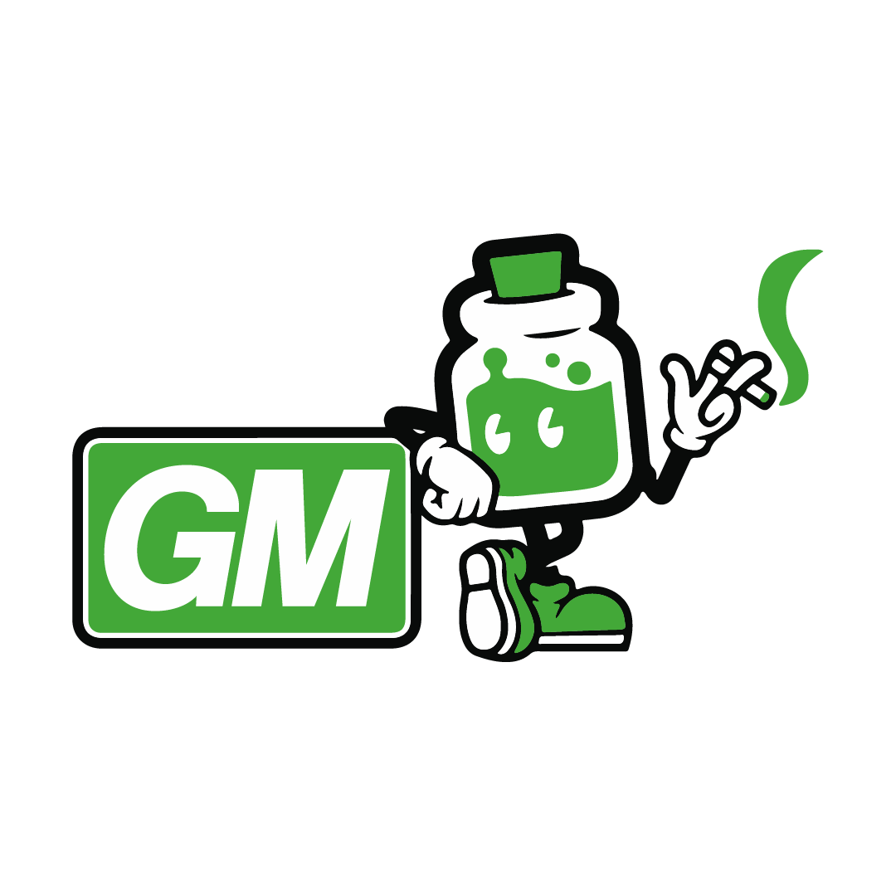

# 🧪 Media Kit

You must use these assets in the form in which they are made available below. To avoid confusion, you may not alter the color, font, proportions, or any other aspect of these logos and design marks.

You must also set a logo or design mark off from the other content appearing in your use, and must not place it in such close proximity to other content that it is indistinguishable from that other content.

## Blend Icons

<figure><figcaption>
Blend Logo
</figcaption></figure> <figure><figcaption>
Bllend App Icon
</figcaption></figure> <figure><figcaption>
Blend Pool Icon
</figcaption></figure> <figure><figcaption>
Blend Token Icon
</figcaption></figure>

## Blend Wordmark + Icon

<figure><figcaption>
Blend Wordmark - White
</figcaption></figure> <figure><figcaption>
Blend Wordmark - Green - Boxed
</figcaption></figure>

<figure><figcaption>
Blend Wordmark - Green
</figcaption></figure> <figure><figcaption>
BlendWordmark - Black
</figcaption></figure>

## Emojis

<figure><figcaption></figcaption></figure> <figure><figcaption></figcaption></figure> <figure><figcaption></figcaption></figure> <figure><figcaption></figcaption></figure> <figure><figcaption></figcaption></figure> <figure><figcaption></figcaption></figure> <figure><figcaption></figcaption></figure> <figure><figcaption></figcaption></figure> <figure><figcaption></figcaption></figure> <figure><figcaption></figcaption></figure> <figure><figcaption></figcaption></figure> <figure><figcaption></figcaption></figure> <figure><figcaption></figcaption></figure> <figure><figcaption></figcaption></figure>

## Basics

[<mark style="color:green;">**Colors**</mark>](https://colorpeek.com/#24a338,e16bff,00c4ef,ff8a00)\
[\
<mark style="color:green;">**Font**</mark>](https://fonts.google.com/specimen/DM+Sans?preview.text=Blend)
