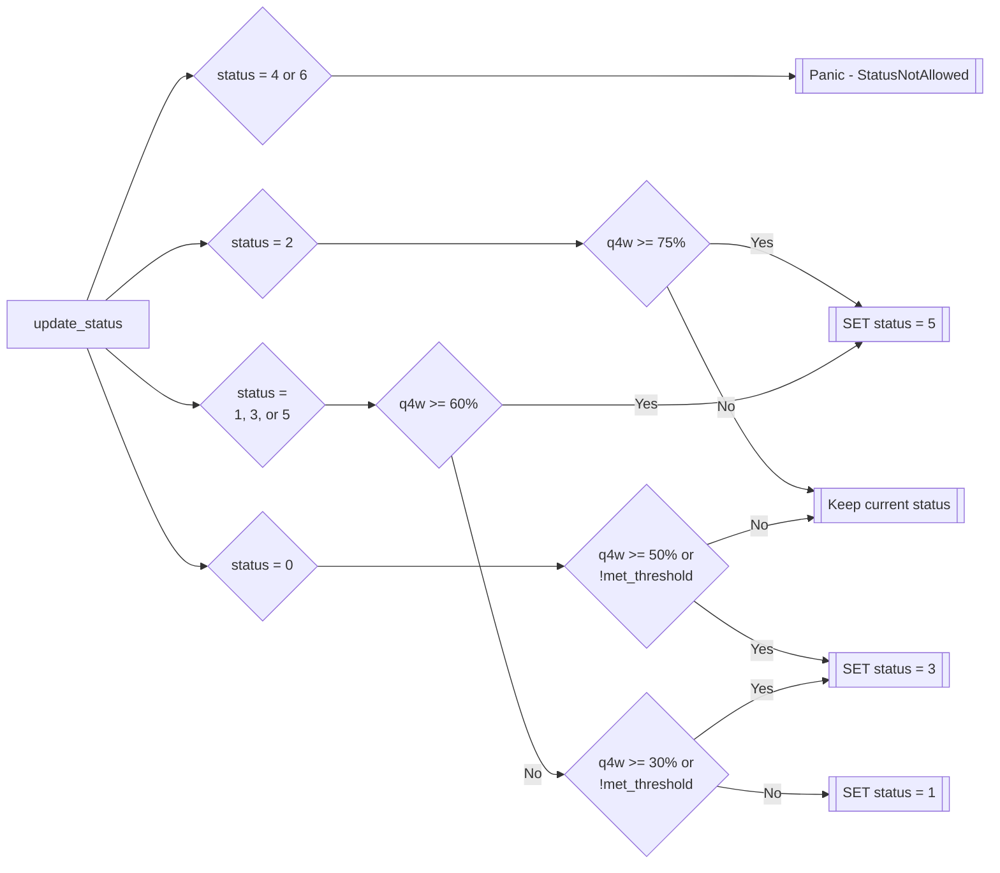
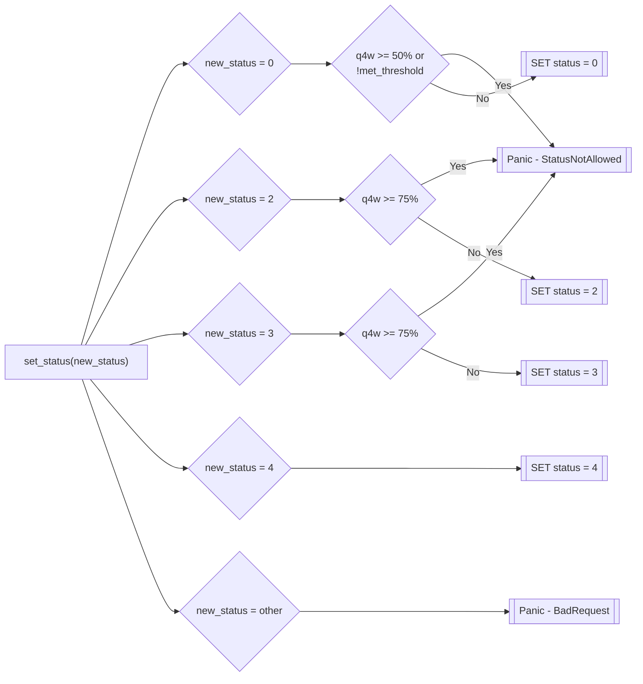

# Pool Management

The Lending Pool contract handles updating pool status and asset parameters.

## Pool Status

Pool status is updated using either a permissionless function, `update_status()` , or a permissioned (admin-only) function `set_status()`. These set the pool to one of the following statuses:

* `Admin_Active` (enum 0): The pool is functioning normally.
* `Active` (enum 1): The pool is functioning normally.
* `Admin_On_Ice` (enum 2): Borrowing and auction cancellations are disabled.
* `On_Ice` (enum 3): Borrowing and auction cancellations are disabled.
* `Admin_Frozen` (enum 4): Borrowing, depositing, and auction cancellations are disabled.
* `Frozen` (enum 5): Borrowing, depositing, and auction cancellations are disabled.
* `Setup` (enum 6): The status the pool is initially set to on creation. Borrowing, depositing, and auction cancellations are disabled.

### Permissionless Updates

Anyone can update pool status permissionlessly by calling `update_status()`. This function checks the backstop state and sets the status based on the current percentage of backstop deposits allocated to the pool that are queued-for-withdrawal (`q4w`), and if the pool's backstop has reached the deposit threshold (`met_threshold`).

The status is set as follows:



### Permissioned Updates

Pool admins can update pool status by calling `set_status()`. This takes a `status` parameter (`new_status` in flowchart) and sets it after validating it with the following logic:



## Asset Parameters

Asset parameters can only be updated by the pool admin. They're updated in a two-step process that involves a 7-day queue to prevent admins from suddenly adding unsafe assets or parameters. The process is as follows:

1. The admin calls `queue_set_reserve()` with the new parameters. This stores a queued reserve update in a hashmap with the address of the asset being added or updated as the key and a `QueuedReserveInit` struct as the value

```rust
pub struct QueuedReserveInit {
    pub new_config: ReserveConfig,
    pub unlock_time: u64, // block timestamp after which the queued reserve config can be added
}
```

```rust
pub struct ReserveConfig {
    pub index: u32,      // the index of the reserve in the list
    pub decimals: u32,   // the decimals used in both the bToken and underlying contract
    pub c_factor: u32,   // the collateral factor for the reserve scaled expressed in 7 decimals
    pub l_factor: u32,   // the liability factor for the reserve scaled expressed in 7 decimals
    pub util: u32,       // the target utilization rate scaled expressed in 7 decimals
    pub max_util: u32,   // the maximum allowed utilization rate scaled expressed in 7 decimals
    pub r_one: u32,      // the R1 value in the interest rate formula scaled expressed in 7 decimals
    pub r_two: u32,      // the R2 value in the interest rate formula scaled expressed in 7 decimals
    pub r_three: u32,    // the R3 value in the interest rate formula scaled expressed in 7 decimals
    pub reactivity: u32, // the reactivity constant for the reserve scaled expressed in 7 decimals
}
```


The queued reserve modification (or addition) can be canceled at any point by the admin using `cancel_set_reserve()`


2. After 7 days have passed the admin calls `set_reserve()` which sets the asset parameters to the queued metadata.
